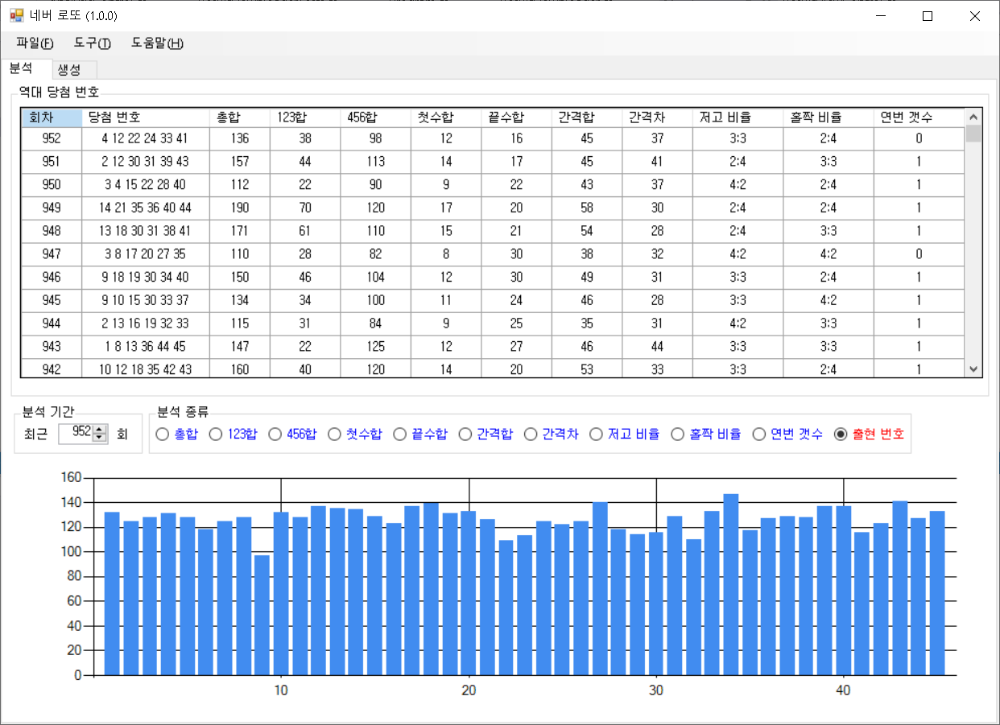
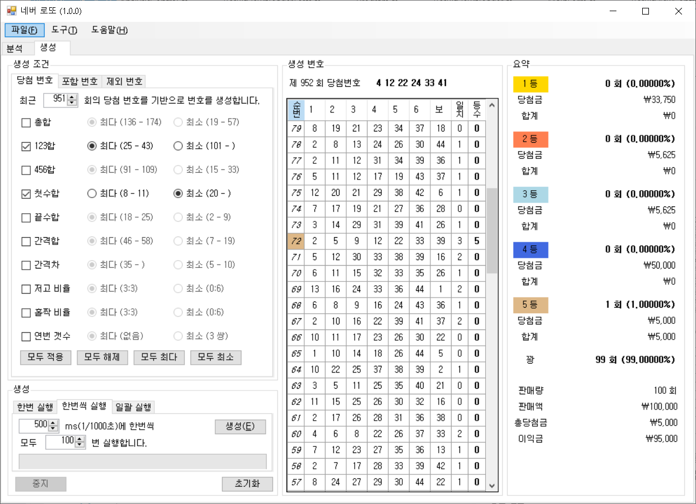
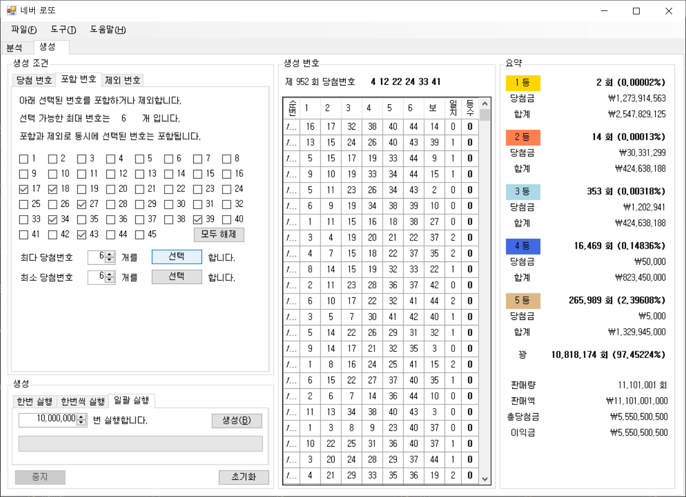

# 네버 로또

* 시중의 로또 번호 추천 서비스를 윈폼으로 구현
* 로또 번호 추천 서비스가 얼마나 **무의미**한지를 체험하게 하는 것이 목적

---------------------------------------
## 실행 방법
1. [다운로드](https://github.com/cplkimth/NeverLotto/releases/download/v1.0/NeverLotto.zip) 후 NeverLotto.exe 실행

## 분석
- 1회부터 최근회까지의 로또 당첨 번호를 가져옴
- `123합`이나 `짝수합` 같은 여러가지 **의미없는** 분석 수행

## 생성
- 시중 유료 서비스와 유사한 방식으로 로또 번호를 생성
- 생성된 번호로 최근회에 로또를 구매한 경우를 시뮬레이션한 결과 표시
- 대규모(백만 회 이상)의 배치 시뮬레이션 지원
- 배치 시뮬레이션은 백그라운드 쓰레드에서 실행되어 UI가 블록되지 않음

